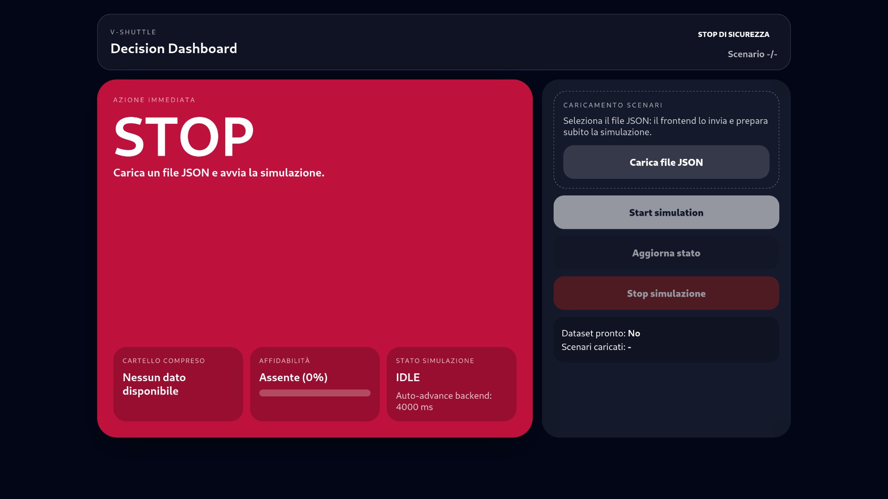
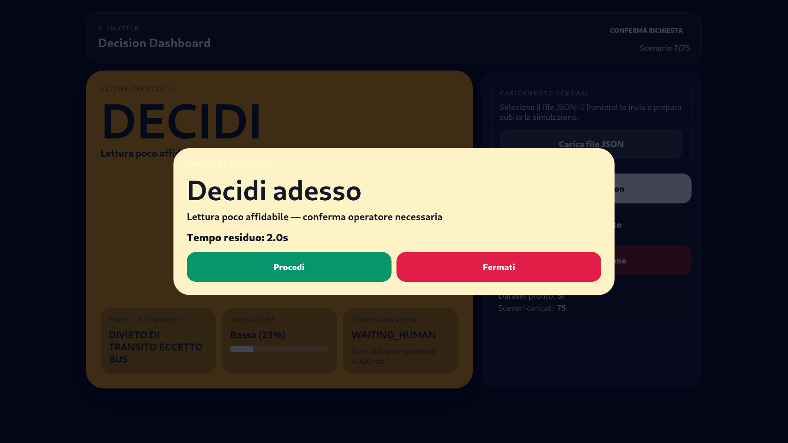
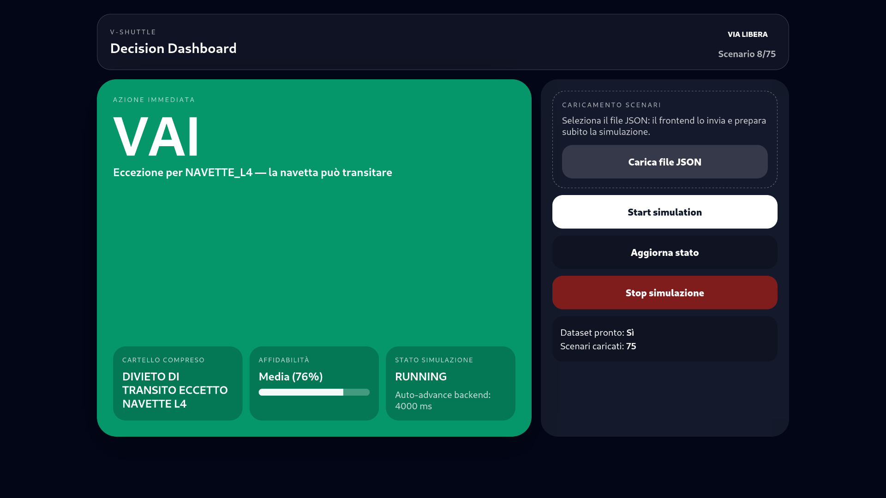
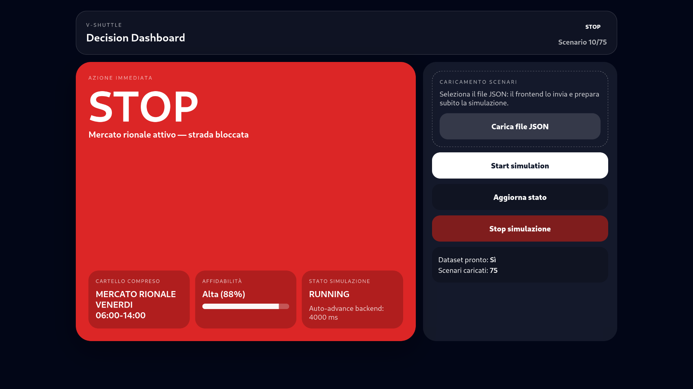
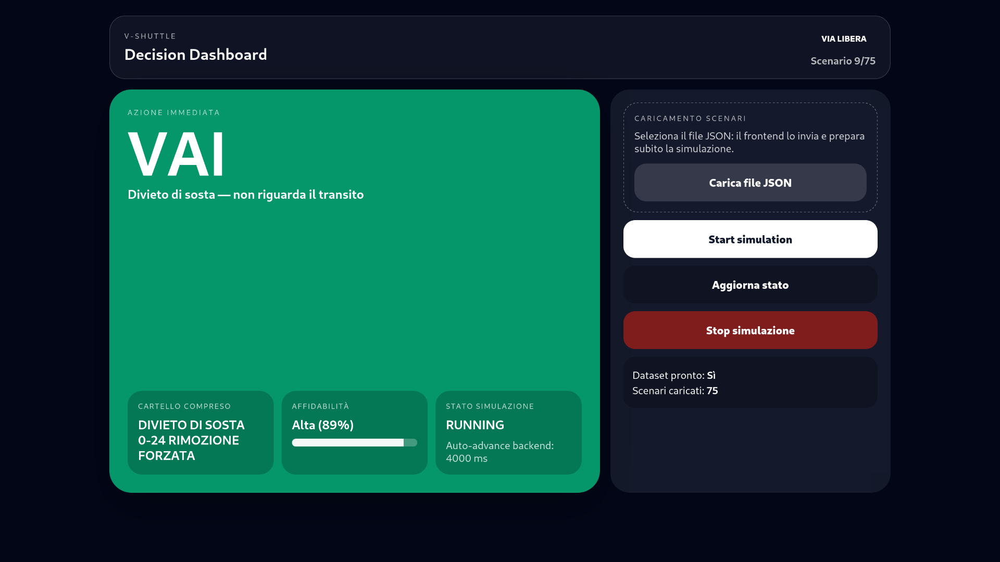
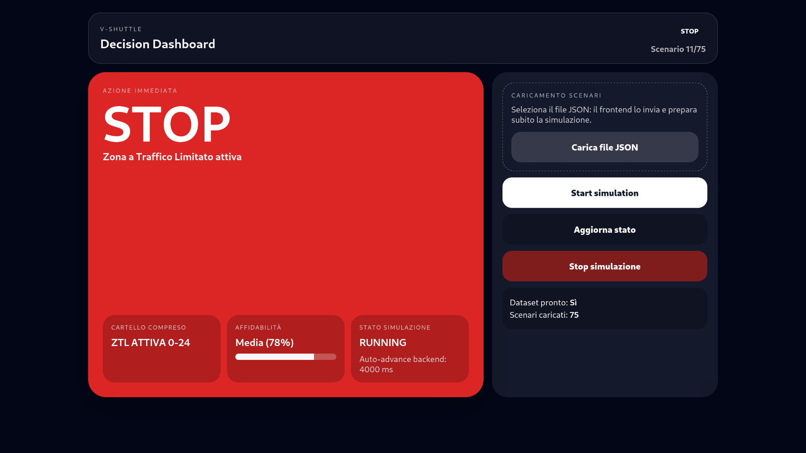
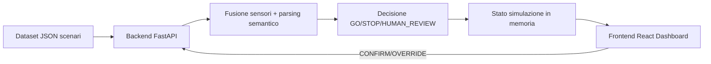

# V-Shuttle — Hackathon Pitch & Build

Dashboard e motore decisionale per la simulazione della navetta autonoma **V-Shuttle** (Waymo LCC), sviluppato durante l'hackathon Hastega.

## Obiettivo del progetto

Il progetto risolve il problema del *disallineamento uomo-macchina* quando il veicolo incontra segnaletica ambigua o deteriorata:
- il backend fonde le letture dei sensori (camera frontale, camera laterale, V2I),
- normalizza testi OCR rumorosi,
- interpreta regole semantiche (divieti, eccezioni BUS, vincoli orari),
- restituisce un'azione operativa (`GO`, `STOP`, `HUMAN_REVIEW`) per la dashboard del Safety Driver.

La dashboard è pensata per decisioni in pochi secondi: stato chiaro, colori immediati, simulazione live automatica e fallback di sicurezza.

---

## Approccio progettuale

Abbiamo impostato il lavoro partendo da una domanda chiave: “Cosa deve capire Marco in meno di 2 secondi?”
Da qui abbiamo separato nettamente il problema in due blocchi:

 - Motore decisionale backend: tutta la logica critica, deterministica e testabile (fusione, parsing, decisione, safety fallback).

 - Dashboard frontend: interfaccia immediata, senza logica duplicata, che mostra solo lo stato deciso dal backend.

Nel backend abbiamo scelto un’architettura a pipeline, con moduli distinti per:

 - correzione OCR / normalizzazione testo

 - fusione sensori

 - parsing semantico

 - decisione finale contestuale

Questa modularità ci ha permesso di adattare velocemente le regole ai casi limite emersi durante l’hackathon senza riscrivere tutto.
Per la parte live abbiamo privilegiato robustezza e semplicità: stato simulazione in memoria + polling frontend, così da ridurre complessità e rischio di desincronizzazione.

La scelta più importante lato sicurezza è stata rendere il sistema fail-safe: in caso di incertezza si passa a `HUMAN_REVIEW`, e in caso di mancata risposta entro timeout si forza `STOP`.
In questo modo abbiamo mantenuto il focus sul requisito reale del cliente: evitare comportamenti ambigui e garantire una decisione sempre comprensibile e sicura.

---

## Team 

Membri e Ruoli:

- `Domenico Commisso` — Developer - Backend e Implementazione Algoritmo, Engine Decisionale 
- `Sebastiano Pastorelli` — Fisico - Progettazione e Implementazione Algoritmo, Correttore OCR
- `Domenico Sabatino` — Developer -  Progettazione Architettura Progetto e Frontend

---

## Setup rapido

Dalla root del repository:

(First Run Only)

```bash
make install-backend
make install-frontend 
```

Con tutte le dipendenze risolte:

```bash
make run
```

Questo comando avvia backend e frontend insieme tramite `run_fullstack.sh`.

### Porte di default

- Backend: `http://127.0.0.1:8000`
- Frontend: `http://127.0.0.1:5173`

### Personalizzazione porte

```bash
BACKEND_PORT=9000 FRONTEND_PORT=5174 make run
```

---

## Screenshot dashboard










---

## Architettura (overview)



### Componenti principali

- **Backend**: FastAPI + pipeline deterministica (`engine/`) per fusione e decisione.
- **Frontend**: React + Vite con polling `/api/simulations/{id}/state` ogni 500ms.
- **Controllo temporale**:
  - avanzamento automatico scenario ogni **4s**,
  - timeout intervento umano a **2s** con fallback automatico su `STOP`.

---

## Avvio manuale

### Backend

```bash
cd backend
python3 -m venv .venv
source .venv/bin/activate
pip install -r requirements.txt
uvicorn app.main:app --host 0.0.0.0 --port 8000
```

### Frontend 
```bash
cd frontend
npm install
npm run dev -- --host 0.0.0.0 --port 5173
```

---

## Endpoint API principali

- `GET  /health`
- `POST /decision/evaluate`
- `POST /api/datasets/load`
- `POST /api/simulations/start`
- `GET  /api/simulations/{simulation_id}/state`
- `POST /api/simulations/{simulation_id}/human-decision`
- `POST /api/simulations/{simulation_id}/stop`

---

## Struttura repository 

```text
.
├── backend/
│   ├── app/
│   │   ├── main.py
│   │   ├── models.py
│   │   └── pipeline.py
├── engine/
├── frontend/
├── run_fullstack.sh
├── Makefile
└── README.md
```
